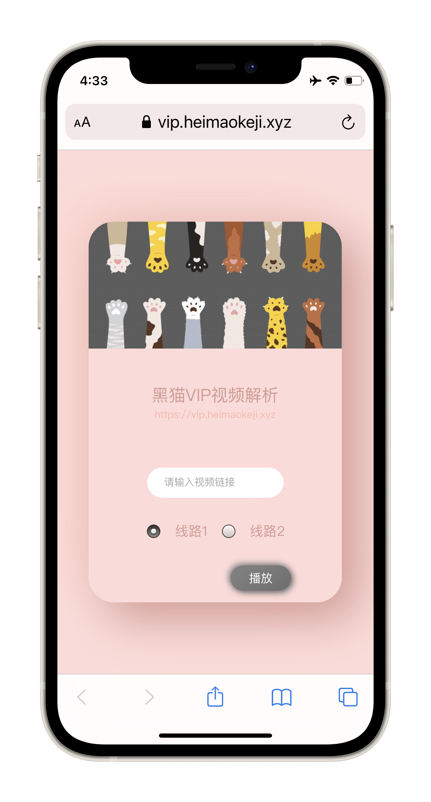
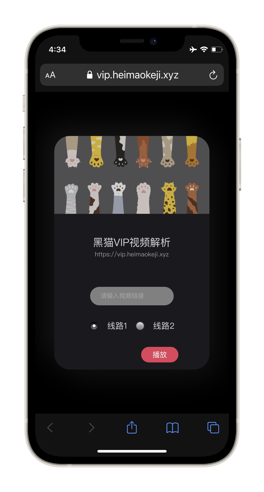

# Vip Video Player

VIP视频解析-前端页面，解析功能由第三方接口实现，本项目无后台，不收集任何数据。

此项目仅用于Web开发学习、交流，请勿商用。

## 更新记录
+ 2022-05-17 修复了 `Dark Mode` 下点击切换线路按钮无效的问题
+ 2021-02-21 新增「定时关闭」功能

## 在线演示
🔗 [https://vip.heimaokeji.xyz](https://vip.heimaokeji.xyz)

## 截图

## 支持深色模式

  
  

## 已知bug
1. 小米手机浏览器加载视频完成后，「左上」和「右上」的圆角失效，显示为直角。（此bug有可能是Android都有的问题，但Android我只测试过小米手机）
2. iOS微信内打开时，翻页到正面后，视频仍会继续播放，几分钟后才停止。**使用Safari浏览器打开即可解决**
---

## Show your support

Give a ⭐️ if this project helped you!